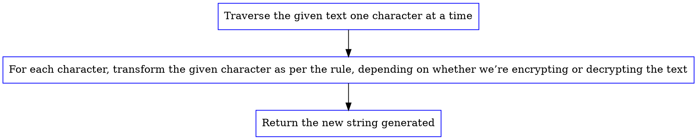
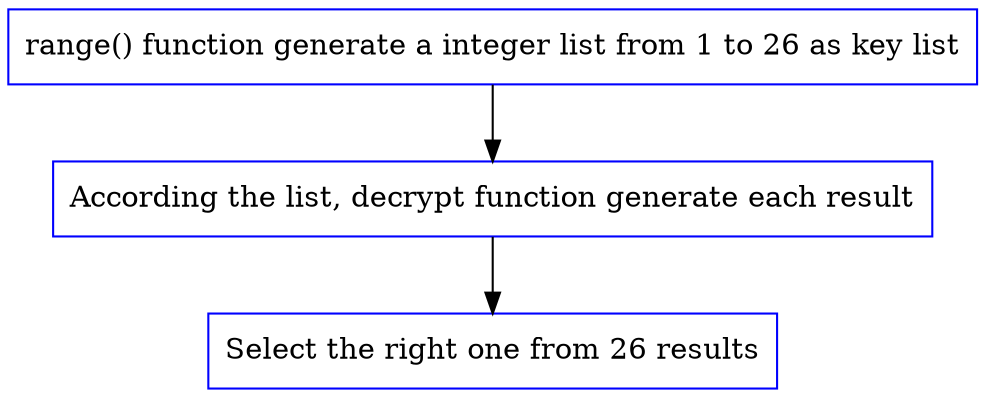

### Caesar Cipher
**Team member**

+ 20171847118 金正旭
+ 20171847121 李昊淼
+ 20171847127 刘思颖

**Lab Environment**

+ Python 3.7.0
+ spyder3

**Achievement**

Using python implement the algotithm about encrypt and decrypt Caesar Cipher and understanding the theory of Vigenère cipher.

**Team work mangage**
+ 金正旭 write the code and debug, do something about export documents
+ 李昊淼 organzied algorithm structure and create data
+ 刘思颖 help debug and summary the theory about the algorithm
#### 1. Caesar Cipher encryption
Caesar Cipher is simply a type of substitution cipher, like each letter of a given text is replaced by a letter some fixed number of positions down the alphabet. Thus to cipher a given text we need an integer value $n$ , known as shift which indicates the number of position each letter of the text has been moved down. We can describe it with mathematic language like:

$$
\begin{align*}
& E_n(x)=(x+n)\ mod \ 26
\end{align*}
$$

(the LaTex doesn't work, we are trying to give a PR to fix that problem,right now we can only replce it by hand :) )

To be more visualization, we can represent it by a graph:


So, our task is very clear, we just to write a programmer to implement this algorithm. I try to creative some example with acm/ICPC competition format, like:
```
Text1:
Input:ABCDEFGHIJKLMNOPQRSTUVWXYZ 23
Output:XYZABCDEFGHIJKLMNOPQRSTUVW

Text2:
Input:ATTACKATONCE 4
Output:EXXEGOEXSRGI
```
We only create two example, because it's not a easy task and need a lot of time. Actually you can find some online OJ in here (http://poj.org/problem?id=1298). Those problems are just different represents by same theory.


We all know that the char type will be invert to ASCII code to store in computer. So, we can use this to encrypt information.

Use command `man ascii`,we can get a table of ACSII code:

```bash
$ man ascii
Oct   Dec   Hex   Char                        Oct   Dec   Hex   Char
────────────────────────────────────────────────────────────────────────
000   0     00    NUL \0   (null character)   100   64    40    @
001   1     01    SOH (start of heading)      101   65    41    A
002   2     02    STX (start of text)         102   66    42    B
003   3     03    ETX (end of text)           103   67    43    C
004   4     04    EOT (end of transmission)   104   68    44    D
005   5     05    ENQ (enquiry)               105   69    45    E
006   6     06    ACK (acknowledge)           106   70    46    F
007   7     07    BEL (bell)                  107   71    47    G
010   8     08    BS  \b   (backspace)        110   72    48    H
011   9     09    HT  \t   (horizontal tab)   111   73    49    I
012   10    0A    LF  \n   (new line)         112   74    4A    J
013   11    0B    VT  \v   (vertical tab)     113   75    4B    K
014   12    0C    FF  \f   (form feed)        114   76    4C    L
015   13    0D    CR  \r   (carriage ret)     115   77    4D    M
016   14    0E    SO  (shift out)             116   78    4E    N
017   15    0F    SI  (shift in)              117   79    4F    O
020   16    10    DLE (data link escape)      120   80    50    P
021   17    11    DC1 (device control 1)      121   81    51    Q
022   18    12    DC2 (device control 2)      122   82    52    R
023   19    13    DC3 (device control 3)      123   83    53    S
024   20    14    DC4 (device control 4)      124   84    54    T
025   21    15    NAK (negative ack.)         125   85    55    U
026   22    16    SYN (synchronous idle)      126   86    56    V
027   23    17    ETB (end of trans. blk)     127   87    57    W
030   24    18    CAN (cancel)                130   88    58    X
031   25    19    EM  (end of medium)         131   89    59    Y
032   26    1A    SUB (substitute)            132   90    5A    Z
....
041   33    21    !                           141   97    61    a
042   34    22                                142   98    62    b
043   35    23    #                           143   99    63    c
044   36    24    $                           144   100   64    d
045   37    25    %                           145   101   65    e
046   38    26    &                           146   102   66    f
047   39    27                                147   103   67    g
050   40    28    (                           150   104   68    h
051   41    29    )                           151   105   69    i
052   42    2A    *                           152   106   6A    j
053   43    2B    +                           153   107   6B    k
054   44    2C    ,                           154   108   6C    l
055   45    2D    -                           155   109   6D    m
056   46    2E    .                           156   110   6E    n
057   47    2F    /                           157   111   6F    o
060   48    30    0                           160   112   70    p
061   49    31    1                           161   113   71    q
062   50    32    2                           162   114   72    r
063   51    33    3                           163   115   73    s
064   52    34    4                           164   116   74    t
065   53    35    5                           165   117   75    u
066   54    36    6                           166   118   76    v
067   55    37    7                           167   119   77    w
070   56    38    8                           170   120   78    x
071   57    39    9                           171   121   79    y
072   58    3A    :                           172   122   7A    z
...
```
We can see that A-Z is 65-90 and a-z is 97-122. That allow our represent those char to int type and that will be more easy to apply the encryption algorithm.

So ,we use python to implement encryption:

```python
#!/usr/bin/env python3
# -*- coding: utf-8 -*-
"""
Created on Thu Sep 25 10:48:24 2019
@author: jason
"""
def encrypt(text,s):
	result = ""

	for i in range(len(text)):
		char = text[i]

		if (char.isupper()):
			result += chr((ord(char) + s-65) % 26 + 65)

		else:
			result += chr((ord(char) + s - 97) % 26 + 97)

	return result


text = input("Please input the infromation you want to encryption:")

s = input("Please input the number n:")
s=int(s)
print ("Text : " + text)
print ("Shift : " + str(s))
print ("Cipher: " + encrypt(text,s))
```
run the programmer in bash:
```bash
$ py3 caesar_encryption.py
Please input the infromation you want to encryption:ATTACKATONCE
Please input the number n:4
Text : ATTACKATONCE
Shift : 4
Cipher: EXXEGOEXSRGI

$ py3 caesar_encryption.py
Please input the infromation you want to encryption:ABCDEFGHIJKLMNOPQRSTUVWXYZ
Please input the number n:23
Text : ABCDEFGHIJKLMNOPQRSTUVWXYZ
Shift : 23
Cipher: XYZABCDEFGHIJKLMNOPQRSTUVW
```
#### 2. Caesar Cipher decryption
#### 2.1 Brute-Force solution
Brute force is the technique of trying every possible key until we find the correct one. Because there are only 26 possible keys, it would be easy for a cryptanalyst to write a hacking program than decrypts with every possible key. Then we could look for the key that decrypts to plain English.

We represent the process as flow graph:


```python
#!/usr/bin/env python3
# -*- coding: utf-8 -*-
"""
Created on Thu Sep 25 22:45:24 2019
@author: jason
"""
def decrypt(text,s):
	result = ""
	for i in range(len(text)):
		char = text[i]

		if (char.isupper()):
		    result += chr((ord(char) + s-65) % 26 + 65)
		elif (char.islower()):
		    result += chr((ord(char) + s - 97) % 26 + 97)
		else :
			result += chr(ord(char) + 0)

	return result


text = input("Please input the infromation you want to decrypt:\n")

for s in range(1,26):
    print (s,": ", decrypt(text,s))
```
Run this programmer in bash:
```bash
$  py3 caesar_decrypt.py
Please input the infromation you want to decrypt:
Lwcjba uig vwb jm xtmiaivb, jcb kmzbiqvbg qa ijaczl.
1 :  Mxdkcb vjh wxc kn yunjbjwc, kdc lnacjrwch rb jkbdam.
2 :  Nyeldc wki xyd lo zvokckxd, led mobdksxdi sc klcebn.
3 :  Ozfmed xlj yze mp awpldlye, mfe npceltyej td lmdfco.
4 :  Pagnfe ymk zaf nq bxqmemzf, ngf oqdfmuzfk ue mnegdp.
5 :  Qbhogf znl abg or cyrnfnag, ohg pregnvagl vf nofheq.
6 :  Rciphg aom bch ps dzsogobh, pih qsfhowbhm wg opgifr.
7 :  Sdjqih bpn cdi qt eatphpci, qji rtgipxcin xh pqhjgs.
8 :  Tekrji cqo dej ru fbuqiqdj, rkj suhjqydjo yi qrikht.
9 :  Uflskj drp efk sv gcvrjrek, slk tvikrzekp zj rsjliu.
10 :  Vgmtlk esq fgl tw hdwsksfl, tml uwjlsaflq ak stkmjv.
11 :  Whnuml ftr ghm ux iextltgm, unm vxkmtbgmr bl tulnkw.
12 :  Xiovnm gus hin vy jfyumuhn, von wylnuchns cm uvmolx.
13 :  Yjpwon hvt ijo wz kgzvnvio, wpo xzmovdiot dn vwnpmy.
14 :  Zkqxpo iwu jkp xa lhawowjp, xqp yanpwejpu eo wxoqnz.
15 :  Alryqp jxv klq yb mibxpxkq, yrq zboqxfkqv fp xyproa.
16 :  Bmszrq kyw lmr zc njcyqylr, zsr acpryglrw gq yzqspb.
17 :  Cntasr lzx mns ad okdzrzms, ats bdqszhmsx hr zartqc.
*18 :  Doubts may not be pleasant, but certainty is absurd.
19 :  Epvcut nbz opu cf qmfbtbou, cvu dfsubjouz jt bctvse.
20 :  Fqwdvu oca pqv dg rngcucpv, dwv egtvckpva ku cduwtf.
21 :  Grxewv pdb qrw eh sohdvdqw, exw fhuwdlqwb lv devxug.
22 :  Hsyfxw qec rsx fi tpiewerx, fyx givxemrxc mw efwyvh.
23 :  Itzgyx rfd sty gj uqjfxfsy, gzy hjwyfnsyd nx fgxzwi.
24 :  Juahzy sge tuz hk vrkgygtz, haz ikxzgotze oy ghyaxj.
25 :  Kvbiaz thf uva il wslhzhua, iba jlyahpuaf pz hizbyk.
```
We can find those sentences make no sense expect 18th sentence. So we can assume that 18th sentence is the plain text.
#### 2.2 Some smart solution
We assume a funny situation that is we communicate only use English. We can find the English have some character, the 'e' is always the most count in daily sentence, so we can assume the character of most count number in cipher is 'e' or 'E', and then we can decrypt the cipher in short time.

This is English Letter Frequencies:


And we write the code about this hack way, but in some situation that use 'e' can not break the cipher, so that we still use the brute force format, but give those possible plain text by order.

And the process of our programmer is:
+ assume the highest frequency in the cipher is `e`
+ if not correct, assume the 2th highest frequency is 'e'
+ continue the process until find the right one

Note: Another idea about that is create a dictionary about the English letter frequencies, and assume the highest count by order in dictionary, we do not know which way are efficiency, it need more research. If we have enough time, we will finish it.

```python
#!/usr/bin/env python3
# -*- coding: utf-8 -*-
"""
Created on Thu Sep 26 09:23:24 2019
@author: jason
"""
def decrypt(text,s):
	result = ""
	for i in range(len(text)):
		char = text[i]
		if (char.isupper()):
		    result += chr((ord(char) + s-65) % 26 + 65)
		elif (char.islower()):
		    result += chr((ord(char) + s - 97) % 26 + 97)
		else :
			result += chr(ord(char) + 0)

	return result

def find():
    flag=1
    i=0
    while(flag==1):
        s = ord('e')-ord(fre[i])
        print ("\n",decrypt(text,s))
        f=input("It's the right sentence? Please input y or n\n")
        if(f=='y'):
            flag=0
        elif(f=='n'):
            flag=1
            i=i+1
        else:
            flag=0
            print("It's not correct input, please try again.")

text = input("Please input the infromation you want to decrypt:\n")
x= text
dict={}

for i in x:
    if(i.islower() or i.isupper()):
        if i in dict:
            dict[i]=dict[i]+1
        else:
            dict[i]=1

fre=sorted(dict, key=dict.__getitem__,reverse=True)
#print(sorted(dict, key=dict.__getitem__,reverse=True))
find()
```
Run this programmer in bash:
```
$py3 caesar_hack_decrypt.py
Please input the infromation you want to decrypt:
Pm ol ohk hufaopun jvumpkluaphs av zhf, ol dyval pa pu jpwoly, aoha pz, if zv johunpun aol vykly vm aol slaalyz vm aol hswohila, aoha uva h dvyk jvbsk il thkl vba.

 Tq sp slo lyjestyr nzyqtopyetlw ez dlj, sp hczep te ty ntaspc, esle td,
 mj dz nslyrtyr esp zcopc zq esp wpeepcd zq esp lwaslmpe, esle yze l hzco
  nzfwo mp xlop zfe.

It's the right sentence? Please input y or n
n

 If he had anything confidential to say, he wrote it in cipher, that is,
 by so changing the order of the letters of the alphabet, that not a word
 could be made out.

It's the right sentence? Please input y or n
y
```
We get the right sentence only try two times.

Note: A little tip is longer sentence have more precision.
#### 3. Vigenère cipher
To encrypt, a table of alphabets can be used, termed a tabula recta, Vigenère square or Vigenère table. It has the alphabet written out 26 times in different rows, each alphabet shifted cyclically to the left compared to the previous alphabet, corresponding to the 26 possible Caesar ciphers. At different points in the encryption process, the cipher uses a different alphabet from one of the rows. The alphabet used at each point depends on a repeating keyword.

This is the Vigenère square:


And in Vigenère cipher, we have three variables, just like this instance:
```
Plaintext:	ATTACKATDAWN
Key:	    LEMONLEMONLE
Ciphertext:	LXFOPVEFRNHR
```
#### 3.1 Vigenère cipher encryption
To encrypt the plaintext we should assume a "KEY" like "LEMON". Then we can export the ciphertext by find the square by letter of plaintxt row and the letter of key column. The letter in the squre is the cipher letter.

The mathematics theory about the encrypt is：
$$
\begin{align*}
& C_i=E_k(M_i)=(M_i+K_i)\ mod \ 26
\end{align*}
$$
#### 3.2 Vigenère cipher decryption
Repeating this process until all plaintext letters are processed, the ciphertext is TWWNPZOA ASWNUHZBNWWGS NBVCSLYPMM. The following has the plaintext, repeated keyword and ciphertext aligned together.
```
MICHI GANTE CHNOL OGICA LUNIV ERSIT Y
HOUGH TONHO UGHTO NHOUG HTONH OUGHT O
TWWNP ZOAAS WNUHZ BNWWG SNBVC SLYPM M
```
To decrypt, pick a letter in the ciphertext and its corresponding letter in the keyword, use the keyword letter to find the corresponding row, and the letter heading of the column that contains the ciphertext letter is the needed plaintext letter. For example, to decrypt the first letter T in the ciphertext, we find the corresponding letter H in the keyword. Then, the row of H is used to find the corresponding letter T and the column that contains T provides the plaintext letter M (see the above figures). Consider the fifth letter P in the ciphertext. This letter corresponds to the keyword letter H and row H is used to find P. Since P is on column I, the corresponding plaintext letter is I.

The mathematics theory about the decrypt is：
$$
\begin{align*}
& M_i=D_k(C_i)=(C_i-K_i)\ mod \ 26
\end{align*}
$$
#### 4. Supplement
+ some dot files to create some process graph by graphviz

encrpt

decrypt

+ online encrypt caesar cipher generator(https://cryptii.com/pipes/caesar-cipher)
+ Caesar cipher From Wikipedia(https://en.wikipedia.org/wiki/Caesar_cipher)
+ Vigenère cipher From Wikipedia(https://en.wikipedia.org/wiki/Vigen%C3%A8re_cipher)
